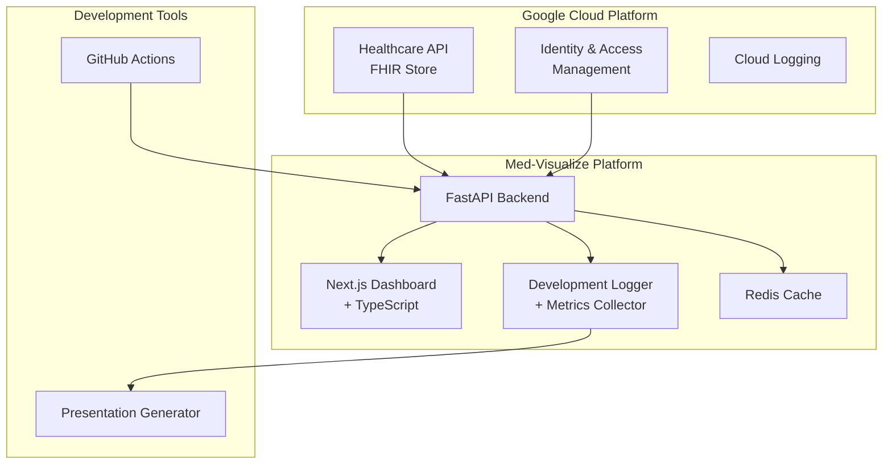

# Med-Visualize: Google Cloud Healthcare API連携型FHIR医療ダッシュボード

## 1. プロジェクト概要

Google Cloud Healthcare APIと連携し、FHIR形式の医療データを取得・可視化するモダンなWebダッシュボードアプリケーション。Antigravity CLIによる開発品質向上機能と、発表資料作成のための包括的なログ機能を内蔵する。

### 1.1 コア要件

1. **Google Cloud Healthcare API連携**
   - FHIR形式データのリアルタイム取得
   - Cloud Healthcare API (FHIR Store) との認証・通信
   - 複数のFHIRリソース（Observation, Patient, DiagnosticReport等）対応

2. **Antigravity CLI統合**
   - コード品質自動監視
   - CI/CDパイプライン統合
   - リアルタイム開発メトリクス

3. **開発ログ・発表資料機能**
   - 開発プロセス全体の自動記録
   - パフォーマンスメトリクス収集
   - プレゼンテーション資料自動生成

4. **モダンWebダッシュボード**
   - レスポンシブデザイン
   - インタラクティブな医療データ可視化
   - リアルタイムデータ更新

## 2. アーキテクチャ設計

### 2.1 システム構成



### 2.2 技術スタック

| レイヤー | 技術 | 選定理由 |
|---------|------|----------|
| **Frontend** | Next.js 16 (App Router) + TypeScript | 最新のReact 19機能、App RouterによるSSR/RSCの活用、型安全性 |
| **UI Library** | shadcn ui + Tailwind CSS v4 + Recharts | Radix UIベースのアクセシブルなUI、Tailwind v4による柔軟なスタイリング、医療データ可視化 |
| **Backend** | FastAPI + Python | 非同期処理、自動API文書生成、医療データ解析ライブラリとの親和性 |
| **Database** | PostgreSQL + Redis | JSONB対応、キャッシュによる高速化 |
| **Cloud** | Google Cloud Platform | Healthcare API、IAM、ログ管理の統合 |
| **DevOps** | Docker + GitHub Actions | コンテナ化、CI/CD自動化 |
| **Quality** | Antigravity CLI + ESLint + Ruff | 包括的コード品質管理 |

## 3. 機能仕様

### 3.1 Google Cloud Healthcare API連携機能

#### 3.1.1 認証・認可
- Service Account による API認証
- OAuth2 / OpenID Connect 対応
- 細粒度アクセス制御（IAM Policy）
- セッション管理とトークンリフレッシュ

#### 3.1.2 FHIRデータ取得
- **Patient Resource**: 患者基本情報取得
- **Observation Resource**: 検査値データ取得
- **DiagnosticReport Resource**: 診断レポート取得
- **Condition Resource**: 診断情報取得
- バッチ取得とストリーミング取得の対応

#### 3.1.3 データキャッシング戦略
- Redis による高頻度アクセスデータのキャッシュ
- キャッシュ無効化ポリシー
- オフライン対応とデータ同期

### 3.2 Antigravity CLI統合機能

#### 3.2.1 開発品質監視
- コード品質メトリクス自動収集
- 技術的負債の可視化
- パフォーマンス回帰検出
- セキュリティ脆弱性スキャン

#### 3.2.3 開発メトリクス
- コード複雑度分析
- テストカバレッジ監視
- API レスポンス時間計測
- メモリ使用量プロファイリング

### 3.3 開発ログ・発表資料機能

#### 3.3.1 自動ログ収集
- 開発アクティビティの時系列記録
- コードコミット履歴分析
- API使用状況ログ
- パフォーマンステスト結果

#### 3.3.2 メトリクス可視化
- 開発進捗ダッシュボード
- 品質トレンドグラフ
- パフォーマンス改善履歴
- チーム生産性指標

### 3.4 モダンWebダッシュボード

#### 3.4.1 ダッシュボード画面構成
1. **患者概要パネル**
   - 基本情報表示
   - 最新検査値サマリー
   - アラート・注意事項

2. **検査値トレンドビュー**
   - 時系列グラフ（JCAL10の県sな項目名）
   - 基準値範囲の帯表示
   - パニック値の強調表示

3. **比較分析ビュー**
   - 複数検査項目の相関分析
   - 同年代平均値との比較
   - 改善傾向の可視化

4. **開発メトリクスパネル**
   - リアルタイム品質指標
   - API パフォーマンス状況
   - システム稼働状況

#### 3.4.2 インタラクション機能
- ドリルダウン分析
- 期間フィルター
- 検査項目選択
- データエクスポート

## 4. 実装フェーズ

### Phase 1: 基盤構築（2週間）
- [x] プロジェクト概要刷新
- [x] Google Cloud プロジェクト設定
- [ ] Healthcare API 有効化・認証設定
- [ ] 基本的なBackend/Frontend構成

### Phase 2: FHIR連携実装（3週間）
- [ ] Healthcare API クライアント実装
- [ ] FHIR リソース取得・パース機能
- [ ] 認証フロー実装
- [ ] データキャッシング機能
- [ ] エラーハンドリング・リトライ機構

### Phase 3: ダッシュボード開発（4週間）
- [ ] Next.js ダッシュボード基盤
- [ ] 医療データ可視化コンポーネント
- [ ] インタラクティブ機能実装
- [ ] レスポンシブデザイン
- [ ] アクセシビリティ対応

### Phase 4: 開発ログ・品質機能（2週間）
- [ ] 開発メトリクス収集機能
- [ ] ログ分析・可視化機能
- [ ] 発表資料生成機能
- [ ] CI/CD パイプライン統合

### Phase 5: 統合テスト・最適化（2週間）
- [ ] E2Eテスト実装
- [ ] パフォーマンステスト
- [ ] セキュリティ監査
- [ ] 本番環境デプロイ準備

## 5. セキュリティ・コンプライアンス

### 5.1 医療情報保護
- 厚生労働省「医療情報システムの安全管理に関するガイドライン」準拠
- HIPAA準拠のデータハンドリング
- 通信・保存時の暗号化（TLS 1.3、AES-256）
- アクセスログ・監査証跡の保持

### 5.2 認証・認可
- Google Cloud IAM による細粒度アクセス制御
- Multi-Factor Authentication (MFA) 必須
- セッション管理・タイムアウト制御
- 最小権限の原則適用

## 6. 品質保証

### 6.1 Antigravity CLI統合
```yaml
# .antigravity.yml
quality_gates:
  code_coverage: 85%
  complexity_threshold: 10
  security_scan: enabled
  performance_budget:
    api_response_time: 500ms
    bundle_size: 2MB
    lighthouse_score: 90

metrics:
  collect:
    - code_quality
    - test_coverage  
    - api_performance
    - security_vulnerabilities
  
reporting:
  format: [json, html, markdown]
  schedule: daily
```

### 6.2 継続的品質改善
- 自動コードレビュー
- パフォーマンス回帰検出
- セキュリティ脆弱性スキャン
- 品質トレンド分析

## 7. 期待成果物

1. **動作するアプリケーション**
   - Google Cloud Healthcare API連携機能
   - モダンなWebダッシュボード
   - リアルタイムデータ可視化

2. **開発品質向上の実証**
   - Antigravity CLI統合による品質メトリクス
   - 継続的改善プロセスの確立
   - 技術的負債の可視化・管理

3. **発表資料・デモンストレーション**
   - 自動生成された開発プロセス資料
   - パフォーマンス改善の定量的証明
   - 医療データ可視化のデモンストレーション

このプロジェクトにより、最新のクラウド技術と品質管理手法を統合した、実用的かつ高品質な医療データプラットフォームを構築します。